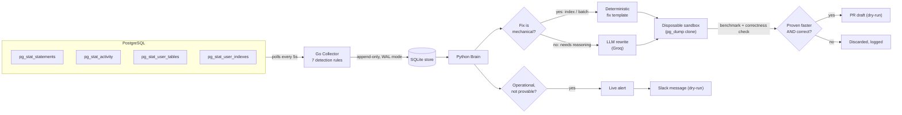
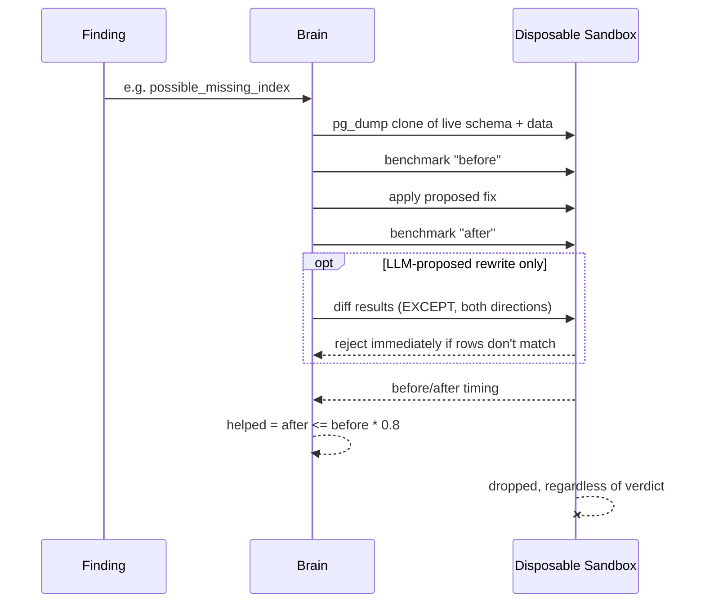

# Vigil

**An autonomous PostgreSQL optimization agent that proves its fixes work before suggesting them — not "the AI thinks this might help," an actual before/after benchmark run in a disposable clone of your database.**

Vigil watches a live Postgres instance, detects real problems (missing indexes, wasted indexes, N+1 query patterns, correlated subqueries, unbounded result sets, stuck transactions, connection exhaustion), and for anything it can *fix* rather than just *flag*, it clones the database into a throwaway sandbox, applies the fix, and benchmarks before vs. after. If the fix doesn't measurably help — or, for LLM-proposed rewrites, doesn't even return the same results — it's silently discarded. Nothing gets proposed on a guess.

---

## What's actually built

Every row below reflects real, working code — not a roadmap. All seven detection rules run end-to-end today; the columns show what happens *after* detection.

| Detection rule | Fix generation | Verification | Output |
|---|---|---|---|
| `possible_missing_index` | Deterministic (`CREATE INDEX`) | ✅ Sandbox-benchmarked (read latency) | PR draft (dry-run) |
| `possible_unused_index` | Deterministic (`DROP INDEX`) | ✅ Sandbox-benchmarked (write latency) | PR draft (dry-run) |
| `nested_subquery` | LLM-proposed rewrite (Groq) | ✅ Sandbox correctness-checked *and* benchmarked | Console (PR generation not built yet) |
| `possible_n_plus_one` | Deterministic (batch via `= ANY(...)`) | ✅ Sandbox-benchmarked (N sequential calls vs. 1 batched call) | Console (PR generation not built yet) |
| `possible_unbounded_query` | — (result-set size is an API contract decision, not a bug) | — | Live alert (dry-run Slack) |
| `idle_in_transaction` | — (operational, nothing to benchmark) | — | Live alert (dry-run Slack) |
| `approaching_max_connections` | — (operational, nothing to benchmark) | — | Live alert (dry-run Slack) |

"Dry-run" means the migration file, PR body, and Slack message are all generated for real and written/printed — nothing is actually pushed to GitHub or posted to Slack yet. That's a deliberate, explicit line (see [What's next](#whats-next)), not an oversight.

---

## Results — real numbers, not estimates

Every number below came from an actual sandboxed benchmark run against real data during development, not a synthetic example.

| Finding | Before | After | Change | How it was proven |
|---|---|---|---|---|
| Missing index, `orders.user_id` | 6.50ms | 0.28ms | **96% faster** | `CREATE INDEX`, timed before/after in a disposable clone |
| Missing index, `order_items.product_id` | ~20ms | ~1.2ms | **93% faster** | same |
| Unused index `idx_users_last_login` | 47.17ms | 41.91ms | 11% faster — **correctly *not* proposed** | write-cost (`UPDATE`) benchmark; below the 20%-improvement bar, so nothing shipped |
| N+1: 196 sequential per-row lookups → 1 batched call | 6.15ms total | 0.11ms | **98% faster** | real query, batched via `= ANY(...)`, sandbox-timed |
| Correlated subquery → `JOIN` + `GROUP BY` (LLM-proposed) | 822.16ms | 46.28ms | **94% faster** | LLM rewrite via Groq, *rejected outright unless* results matched the original exactly, timed only after passing that check |

The unused-index row matters as much as the fast ones: it's the system correctly saying *no*. A tool that only ever reports wins isn't proving anything.

---

## Architecture



### The sandbox: "prove it, don't trust it" in detail



Every sandbox is a full `pg_dump`/`psql` clone of the live database, created fresh and dropped immediately after — nothing persists between checks, and nothing is ever benchmarked against synthetic data. The 20%-improvement bar (not just "any improvement") exists specifically to filter out noise: the unused-index result above (11% faster) shows it working as intended.

---

## A bug this project found in itself

Midway through building the third detection rule, the system started reporting the same two confusing things every run: a phantom "missing index" on `users.id` (already a primary key — impossible) and a 117-way explosion of false `nested_subquery` findings.

The root cause turned out to be one query with a missing scope: `pg_stat_statements` is **cluster-wide**, not per-database, and the collector's polling query had no `WHERE dbid = ...` filter. Every disposable sandbox this same system creates and drops runs its own benchmark queries — and `pg_stat_statements` doesn't clean those up when the database is dropped. A direct check confirmed it: **4,872 total tracked statements, only 162 belonging to live databases** — the other 4,710 (97%) were orphaned rows from already-deleted sandbox clones, silently getting correlated against the real database's stats.

One `WHERE dbid = (SELECT oid FROM pg_database WHERE datname = current_database())` fixed both symptoms at once, because they'd always been the same bug. Five other real bugs were found and root-caused the same way during development — a Cloudflare 403 that had nothing to do with the API key, SQLite's default journal mode silently blocking concurrent readers, a regex that attributed a WHERE-clause filter to the wrong table in a JOIN — kept as personal notes, not published in this repo.

The correctness check in the sandbox caught its own class of bug too: when pointed at real, gnarly Postgres internals (via `pg_dump`'s own catalog queries), the LLM produced plausible-*looking* rewrites for 8 different queries — 6 of them were subtly wrong (different result sets) and were rejected automatically, before their timing was ever considered.

---

## Project structure

```
vigil/
├── collector/              # Go -- polls Postgres stats, runs the 7 detection rules
│   ├── internal/metrics/   #   pg_stat_statements/activity/tables/indexes pollers
│   ├── internal/rules/     #   detection logic (detect.go)
│   └── internal/store/     #   SQLite persistence (WAL mode)
├── brain/                  # Python -- turns findings into proven fixes or alerts
│   └── vigil_brain/
│       ├── fixes/          #   deterministic fix templates (index, n+1 batching)
│       ├── llm/            #   Groq client, used only for nested_subquery
│       ├── sandbox/        #   disposable clone + benchmark + correctness check
│       ├── actions/        #   PR draft / Slack message generation (dry-run)
│       └── alerts.py       #   live operational alerts (no sandbox needed)
├── demo-app/                # FastAPI + SQLAlchemy "victim" app -- deliberately bad
│                             #   query patterns, used to generate real findings
├── infra/                  # docker-compose: Postgres, demo-app, PgBouncer, collector, brain
├── ROADMAP.md               # everything deliberately deferred, and why
└── learning-log.md          # real bugs hit during development, root-caused
```

---

## Getting started

```bash
git clone <this-repo>
cd vigil/infra

# optional: enables the nested_subquery LLM rewrite path. Everything else
# (index fixes, N+1 batching, all alerts) works without it.
echo "GROQ_API_KEY=<your key>" > .env

docker compose up -d

cd ../demo-app
alembic upgrade head    # schema + deliberate flaws (must run before seeding)
python seed.py
python load.py          # separate terminal: generates continuous query traffic

# watch the collector detect things in real time
docker compose logs -f collector

# run brain against whatever's been found so far
cd ../infra
docker compose run --rm brain
```

---

## Design principles

- **Prove it, don't trust it.** Every fix that isn't provably correct-by-construction (an index change can never alter query results) gets benchmarked, and LLM-proposed rewrites additionally get their results diffed against the original before timing counts for anything.
- **Deterministic where possible, LLM only where necessary.** 5 of 7 rules need no LLM at all — index changes and N+1 batching are mechanical transforms with correctness guaranteed by the query shape itself. The LLM is reserved for the one case (subquery→JOIN rewriting) that genuinely requires understanding intent.
- **Operational issues bypass the sandbox.** A stuck transaction or a near-full connection pool needs a human *now* — there's nothing to benchmark in an emergency, so these go straight to an alert instead of through fix-verification.
- **Fail closed, not loud.** A malformed finding, an unreachable LLM, an unrecognized query shape — all of these skip that one item and move on, rather than crashing the whole pipeline or guessing.
- **Least privilege — designed for, not fully implemented yet.** The sandbox currently reuses the same superuser credential as the rest of the dev stack; a real deployment should scope it to a dedicated, narrower role. Tracked honestly in [`ROADMAP.md`](ROADMAP.md), not glossed over.

---

## What's next

The short version — full detail with reasoning for every item is in [`ROADMAP.md`](ROADMAP.md):

- **Go live.** Wire the dry-run PR/Slack output to real `gh pr create` calls and a real Slack webhook, for the rule(s) already fully proven.
- **PR generation for query rewrites.** `nested_subquery` and `possible_n_plus_one` fixes are application-code changes (editing a SQL string in source), not schema migrations — needs a source-diff generator, not the existing Alembic-migration one.
- **Deadlock detection.** Lives in Postgres's log file, not any stats view — a structurally different mechanism than everything built so far.
- **PgBouncer pool-mode recommendation.** Nothing in the current stack actually routes traffic through PgBouncer yet, so there's nothing real to reason about pooling from.
- **Table/index bloat detection.** Built, but disabled — every test so far had autovacuum clean up dead tuples before the threshold was honestly crossed. Needs a bigger, busier table to test against.
- **pgvector/HNSW index health.** The demo app already seeds the exact bug (an HNSW index built on an empty table); nothing detects it yet.
- **Findings staleness/expiry.** The store only ever grows; a finding whose condition has since resolved doesn't currently get marked as such.

---

## Demo app

`demo-app/` is a "victim" application that exists purely to generate realistic bad
query patterns for Vigil to detect and fix. Every endpoint below is deliberately
inefficient or broken — that's the point, not a bug.

### What each endpoint demonstrates

- `GET /orders-bad` — N+1 queries: fetches orders, then lazy-loads `order.user` per row.
- `GET /orders-good` — the same result via a single `JOIN`, for comparison.
- `GET /order-summary-nested/{user_id}` — per-order correlated subqueries instead of a `JOIN` + `GROUP BY`.
- `GET /orders-by-user/{user_id}` — filters on `orders.user_id`, which has no index.
- `GET /all-inventory-logs` — returns the entire table, no `LIMIT`, no pagination.
- `POST /bulk-import-products` — bulk-inserts fake products in one commit, producing stale planner statistics.
- `GET /reviews-by-product/{product_id}` — filters on `reviews.product_id`, which has no index.
- `GET /leaky` — opens a raw `Session` outside the request lifecycle and never closes it, leaking a connection.
- `POST /reserve-stock/{product_id}` — locks product, then order, sleeping in between to widen the race window.
- `POST /log-order/{order_id}` — locks order, then product (opposite order from above) — pairs with it to produce a deadlock.
- `POST /slow-transaction` — holds a connection open for 5s on `pg_sleep(5)`; hammer it concurrently to exhaust the pool.
- `POST /simulate-churn` — rapidly inserts and deletes `inventory_logs` rows to generate dead tuples/bloat, without ever vacuuming.
- `GET /search-similar-products?q=...` — pgvector similarity search, useful for demonstrating the empty-table HNSW index bug (see below).

Schema-level flaws (applied by the `0002_deliberate_flaws` migration, not the endpoints above):

- Duplicate indexes on `products.category` (`idx_products_category` / `idx_products_cat_dup`).
- An index on `users.last_login_at` that nothing ever queries.
- An HNSW index on `product_embeddings` built *before* any embeddings exist, reproducing pgvector's empty-table garbage-centroids bug.

Schema is managed by [Alembic](https://alembic.sqlalchemy.org/) (`demo-app/alembic/`), not an ad-hoc script — `0001_initial_schema` creates the real tables (matching `app/models.py` exactly), `0002_deliberate_flaws` layers the intentional flaws on top.

### How to run

> **Note:** the run order here differs from a natural "seed first" instinct —
> migrations must run *before* `seed.py`, because the HNSW empty-table bug
> only reproduces if the index is built while `product_embeddings` is still
> empty.

```bash
cd infra
docker compose up -d

cd ../demo-app
alembic upgrade head        # applies schema + deliberate flaws (must run first)
python seed.py               # seeds users/products/orders/etc.
python load.py                # in a separate terminal: generates continuous traffic
```

To reproduce the deadlock, call `/reserve-stock/{product_id}` and `/log-order/{order_id}`
**concurrently** (e.g. from two terminals at once) using a product and order that share
an `order_items` row — look one up first:

```bash
psql ... -c "SELECT order_id, product_id FROM order_items LIMIT 1;"

# terminal 1
curl -X POST http://localhost:8000/reserve-stock/<product_id>
# terminal 2, started immediately after
curl -X POST http://localhost:8000/log-order/<order_id>
```

---
